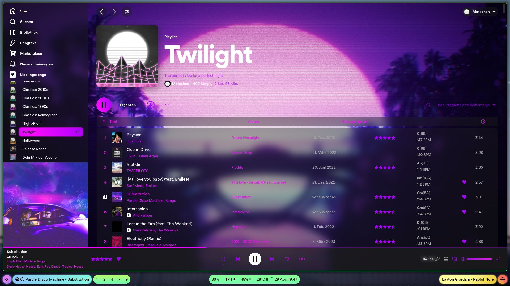
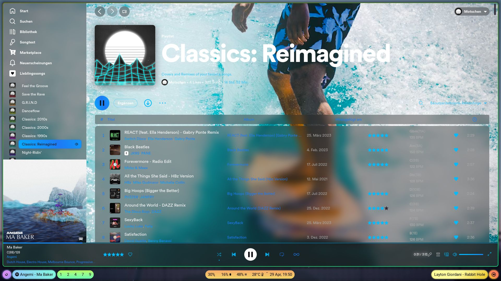
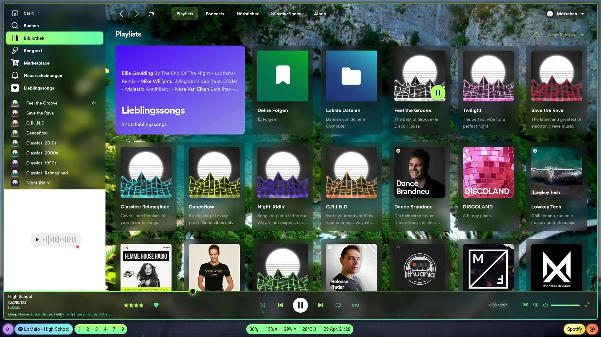
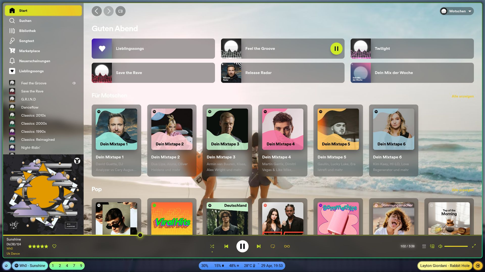
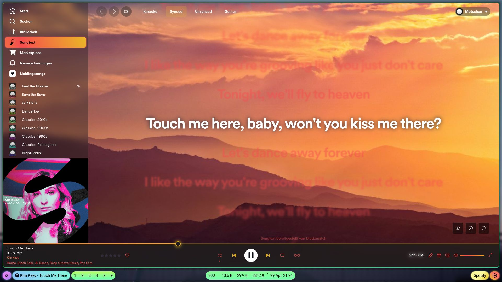
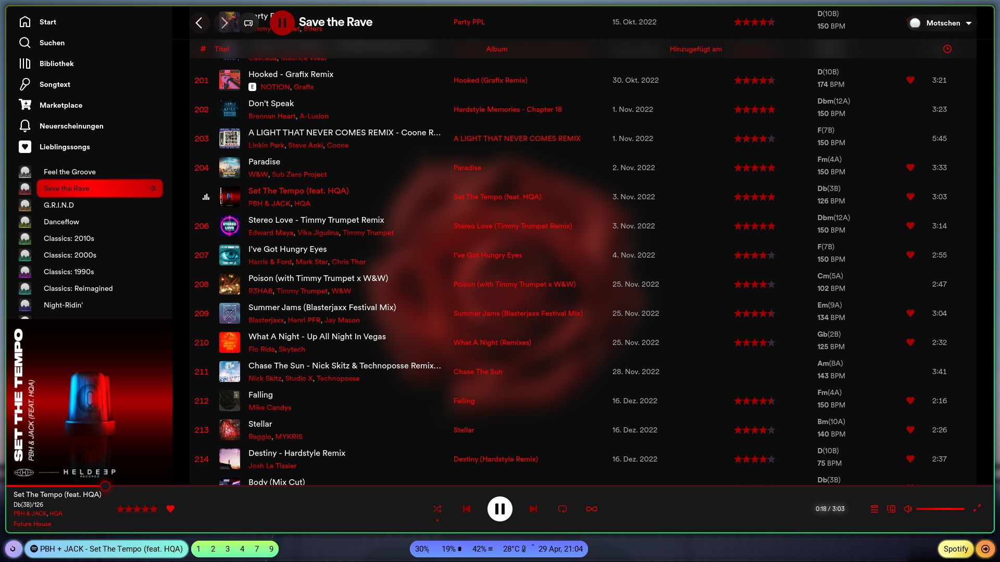

<h1 align="center">Retroblur</h1>

Spicetify theme with lots of blur, animations, hacks, gradients and retro elements. 
Based on https://github.com/schnensch0/ziro  
Copyright © 2023 Motschen - MIT License 

 

To change the color of the background, edit the link at the start of user.css  
It's sadly not possible to change the background together with the color scheme automatically due to the limitations of CSS.
 

